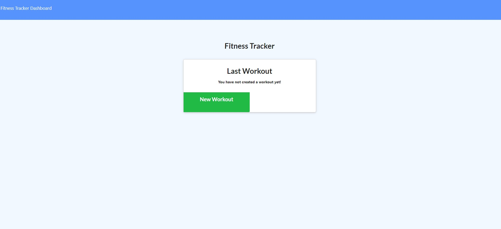

# Fitness Tracker

An app for anyone interested in tracking and comparing workouts.

## Table of Contents

- [Description](#Description)

- [Usage Guide](#Usage-Guide)

- [Questions and Reporting](#Questions-and-Reporting)

- [License Information](#License-Information)

## Description

New year, new you! Whatever the time of year, if you find yourself in need of a way to track workout regimens and compare your stats, this is the app fo you!

This app allows a user to fill in details for any exercises they do and combine them into a workout. During or after the workout, the user can see statistical information relating to all of the exercises they have done including weight (for resistance training) and distance (for cardio training). The app will store the data, and at any time the user can navigate to the stats page and see their overall progress, as well as which workouts give them the highest numbers.

## Usage Guide

Using this app is as simple as navigating in a browser to https://blooming-beach-22911.herokuapp.com/. After that, it should look like this:

Once there, the user may begin a new workout. For their workout, the user chooses whether their first exercise was resistance or cardio, then inputs the relevant exercise information. Once finished, the user may simply click "Add Exercise" if they wish to continue working out, or "Complete" to finish their workout for the time being. After inputting at least one workout, users may visit the stats page to see graphical representation of their workout data.

## Questions and Reporting

This app was an assignement to help me learn mongo, mongoose, and server-side programming. I do not forsee updating this at any time, as it does what it is meant to do. If, for some reason, you feel the need to use my app and run into problems, feel free to contact me through [my github](https://kirkpatrickpaul.github.io/contact.html).

## Liscence Information

For the Fitness Tracker, I use the MIT license.
